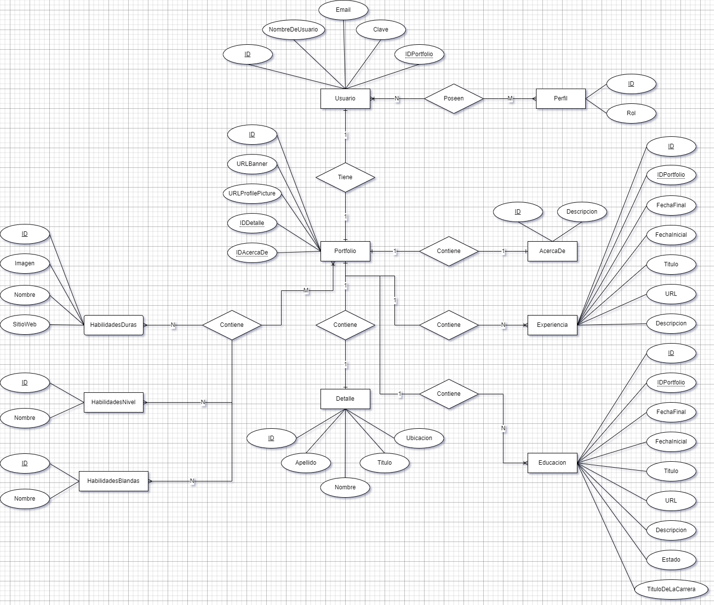

# PortfolioBackend

## Descripción

Este proyecto es una <b>API REST</b>.

## Documentación <b>API-REST</b>

* [Documentación Generada Por Swagger UI y Open API](https://portfoliobackend-devusuisama.onrender.com/swagger-ui-devusuisama.document)

## Diagrama DER

## Construido con 🛠️

* SpringBoot 3.0.1
* Java 19

## Autor ✒️
* **Usui, José Fernando** - *Diseño y Desarrollo del Sistema*

## Contacto 📱
* Gmail: _joesesilvae@gmail.com_